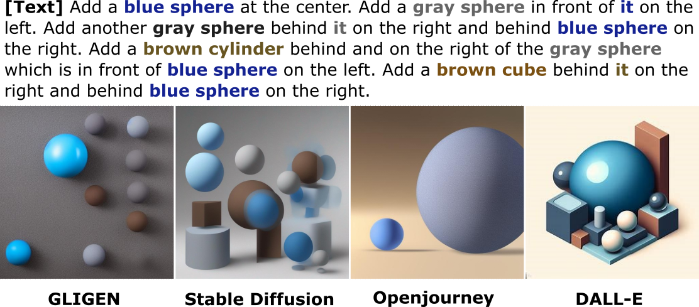
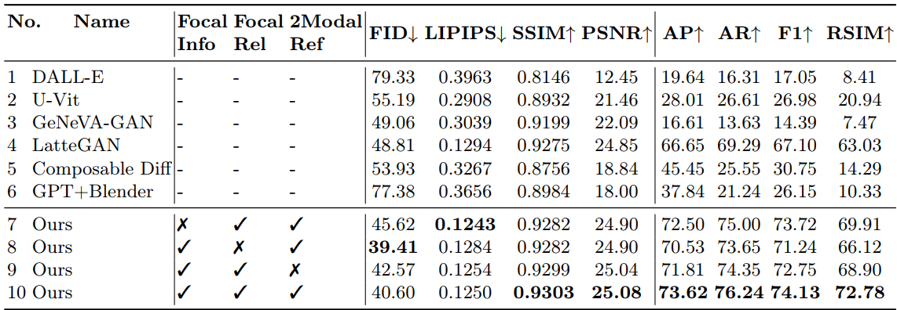
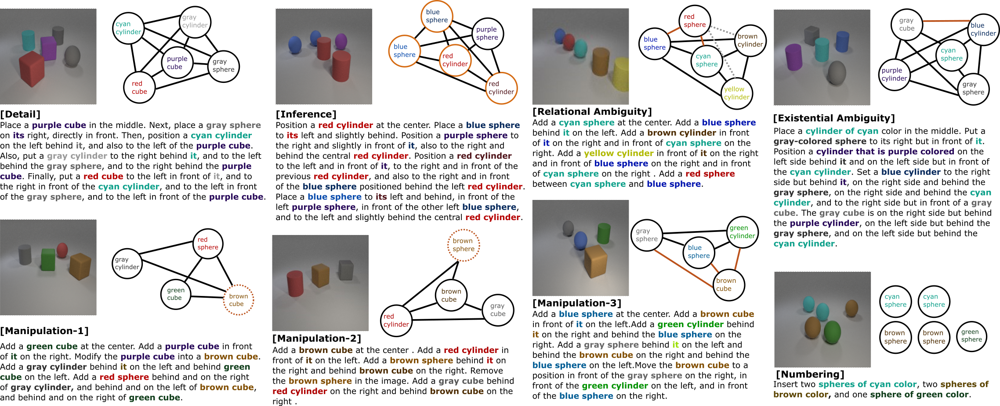
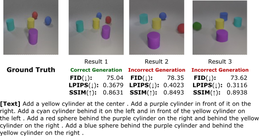

# Textual-Visual Logic Challenge: Understanding and Reasoning in Text-to-Image Generation

Our paper "[Textual-Visual Logic Challenge: Understanding and Reasoning in Text-to-Image Generation](https://eccv.ecva.net/)" accepted at ECCV 2024. If you find the code useful, please cite the following paper.

```bibtex
@inproceedings{xiong2024textual,
  title={Textual-Visual Logic Challenge: Understanding and Reasoning in Text-to-Image Generation},
}
```

## Quick Links
- Overview
- Results
- Dataset
- Evaluation Metrics

## Overview
Text-to-image generation plays a pivotal role in computer vision and natural language processing by translating textual descriptions into visual representations. 
However, understanding complex relations in detailed text prompts filled with rich relational content remains a significant challenge. 

<div align="center">
  
  <div>
    <em style="font-family: Arial, sans-serif; margin-top: 10px; display: block;">
      Figure 1: Current works fail to generate structurerelated information from text prompts, particularly when logical reasoning is involved.
    </em>
  </div>
</div>
<br>

To address this, we introduce a novel task: Logic-Rich Text-to-Image generation. 
Unlike conventional image generation tasks that rely on short and structurally simple natural language inputs, our task focuses on intricate text inputs abundant in relational information. 
To tackle these complexities, we collect the Textual-Visual Logic dataset, designed to evaluate the performance of text-to-image generation models across diverse and complex scenarios. 


## Results
<div align="center">
  
</div>
  <div>
    <em style="font-family: Arial, sans-serif; margin-top: 10px; display: block;">
      Table 1: Quantitative analysis and ablation study comparisons.
      Baseline and proposed methods are benchmarked on the TV-Logic dataset using eight evaluation metrics: average precision (AP), average recall (AR), F1 score, relational similarity (RSIM), Fréchet Inception Distance (FID), Learned Perceptual Image Patch Similarity (LPIPS), Structural Similarity Index Measure (SSIM), and Peak Signal-to-Noise Ratio (PSNR).
    </em>
  </div>

## Dataset
[Download Link](https://)

To better evaluate understanding and reasoning in the text-to-image generation task, we have compiled a novel dataset comprising 15,213 samples. 
Each sample includes a long, content-rich text prompt and its corresponding images. 
To assess the degree of reasoning required, we have established six categories for the logical-rich text-to-image generation (LRT2I) task 

<div align="center">
  
</div>
  <div>
    <em style="font-family: Arial, sans-serif; margin-top: 10px; display: block;">
      Figure 2: Overview of TV-Logic Dataset Categories. This composite image illustrates the diverse challenges in text-to-image generation, showing six categories for model evaluation.
      These categories demonstrate the diverse challenges in text-to-image generation.
      Within each category, the graph depicts scene information derived from text prompts.
      Solid edges signify relations explicitly mentioned in the prompts, while dashed edges indicate unmentioned relations. Orange lines represent case-related information.
    </em>
  </div>
  
## Evaluation Metrics
[Evaluation Files](https://)

For task evaluation, to effectively assess the model performance in generating images that comprehend the structural information in text input, specific evaluation metrics, rather than a pixel-level measurement, are required. 
Given the ill-posed nature of the problem in below figure, these metrics should concentrate on aligning entity presences and their respective relations between the ground-truth and generated images.
Consequently, the objectives of the task should also prioritize these aspects.
<div align="center">
  
    <div>
    <em style="font-family: Arial, sans-serif; margin-top: 10px; display: block;">
      Figure 3: Limitations of existing evaluation metrics in accurately assessing model performance.
    </em>
  </div>
</div>
<br>

We adapted evaluation metrics from previous works, which emphasizes relational information similar to our study, making its methodology applicable for our evaluation. We adopted two main metrics:

+ **Object Presence Matches:** Evaluates model accuracy in identifying and generating objects from text prompts, comparing objects in generated images and ground truth. Metrics include average precision (AP), average recall (AR), and F1 score for each scene.

+ **Object Position Relation Matches:** Assesses spatial accuracy by comparing object positions in generated images with the ground truth, indicating the model's understanding of spatial dynamics from the text.
The relational similarity (RSIM) is set to measure object arrangement. 
The RSIM is articulated as:

$$
RSIM(E_{G_{gt}}, E_{G_{gen}}) = \text{recall} \times \frac{|E_{G_{gt}} \cap E_{G_{gen}}|}{|E_{G_{gt}}|}
$$

Here, `recall` represents the ratio of detected objects in the generated image in relation to those in the ground-truth. $E_{G_{gt}}$ and $E_{G_{gen}}$ denote the sets of relational edges for the ground-truth and generated images, respectively, concerning vertices shared by both images.


## License
Under review by the Governance, Risk, and Compliance Department.
